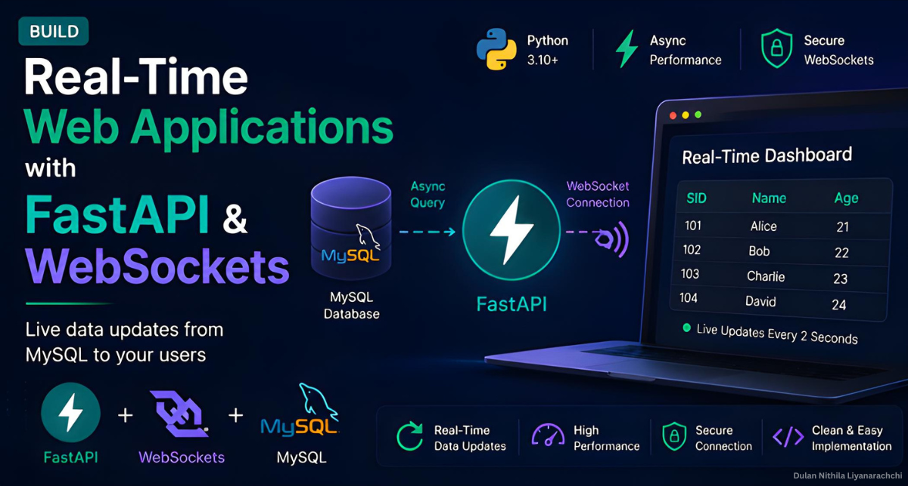

# A Real-Time FastAPI Dashboard with WebSockets and Async MySQL
A real-time dashboard built with FastAPI, WebSockets, and Async MySQL, featuring live database updates, secure WebSocket communication, and a complete setup guide with source code.  

Article is available on the following platforms 
* **LinkedIn:** [Read on LinkedIn](https://www.linkedin.com/pulse/building-real-time-fastapi-dashboard-websockets-async-liyanarachchi-nvf7c/)
* **Medium:** [Read on Medium](http://dulannithilaliyanarachchi.medium.com/building-a-real-time-fastapi-dashboard-with-websockets-and-async-mysql-344d86522a0e?postPublishedType=repub)
* **AWS:** [Read on AWS](https://builder.aws.com/content/3Ij3xiZllF1UvwYpk5OCYx52UfK/building-a-real-time-fastapi-dashboard-with-websockets-and-async-mysql)
* **DEV Community:** [Read on DEV Community](https://dev.to/dulannithilaliyanarachchi/building-a-real-time-dashboard-with-fastapi-websockets-and-mysql-1494)

 

